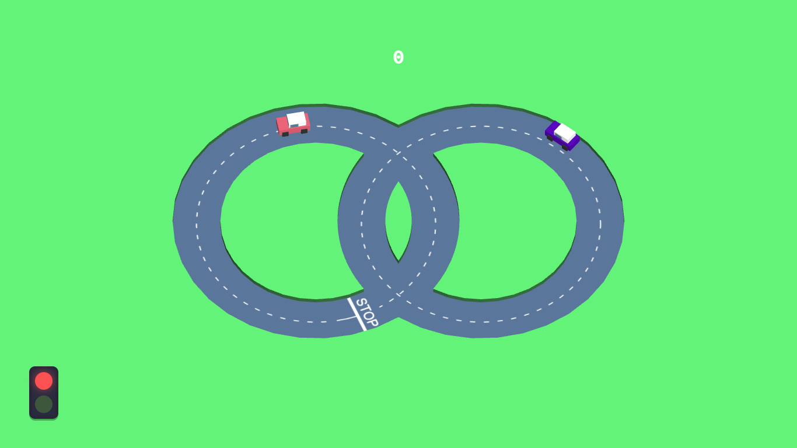
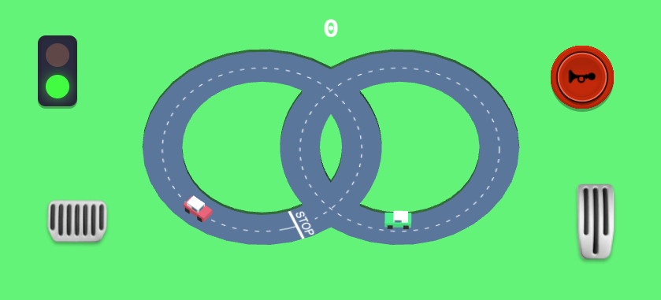

<h1 align="center">Cars.io  v.1.0</h1>
<br>
<br>
<br>

Live web preview [here](https://zhenglinlei.github.io/cars.io)

<p align="center">
    
</p>
<p align="center">
    
</p>

<br>

<p align="center">
  <a href="./CONTRIBUTING.md">Contributing</a>
  ·
  <a href="https://github.com/ZhengLinLei/cars.io/issues">Issues</a>
</p>

<p align="center">
  <a href="https://opensource.org/licenses/Apache-2.0">
    
  </a>&nbsp;
  <a>
    
  </a>
</p>

<hr>

## 📁 Source Code

The main project file code in `./js/script.js`.

This project was made with the help of:

    * Three.js


CDN:
```HTML
<script src="https://cdnjs.cloudflare.com/ajax/libs/three.js/r128/three.min.js" integrity="sha512-dLxUelApnYxpLt6K2iomGngnHO83iUvZytA3YjDUCjT0HDOHKXnVYdf3hU4JjM8uEhxf9nD1/ey98U3t2vZ0qQ==" crossorigin="anonymous" referrerpolicy="no-referrer"></script>
```


## 🎮 How to play?

You must to rotate all the circle and pass the stop when the traffic light is in green, or you will be fined removing 1 point from you scorebar.

### Desktop device

```
Up: Go!
Down: Brake

r: Restart
h: Honk
```

### Touch device

```
All options in the screen
```


### Love this repo? Give us a star ⭐

<a href="./">
  
</a>